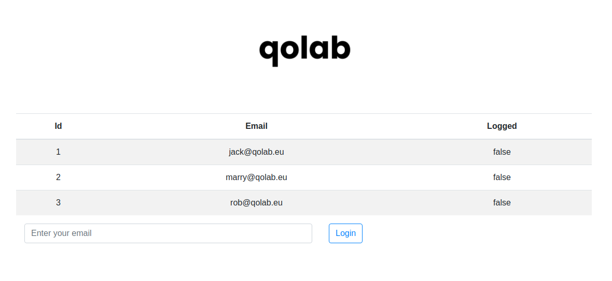
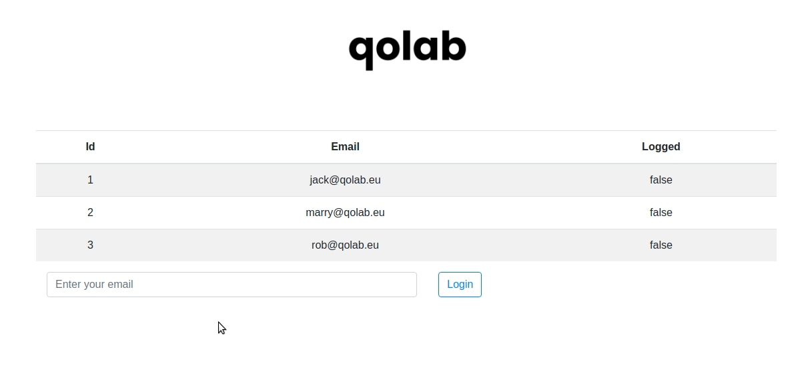
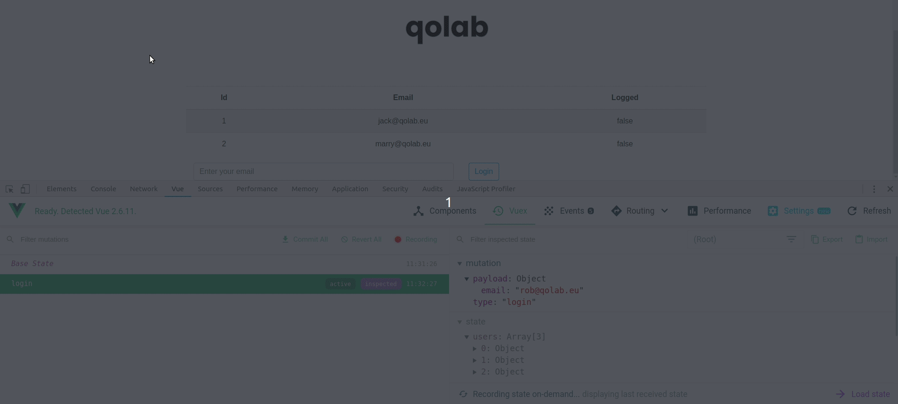

# Prečo sa vôbec zaujímať o Vuex

Aby sme si vedeli odpovedať na túto otázku musíme najprv vedieť čo Vuex vôbec je. Vuex je knižnica pre Vue.js aplikácie, ktorá sa zaoberá tzv. "state" manažmentom aplikácie. Zmysel má hlavne v stredných a väčších webových aplikáciach, ktoré sa skladajú z väčšieho počtu komponentov. Tieto komponenty potrebujú vo väčšine prípadov medzi sebou komunikovať. V čistom Vue.js je táto komunikácia vyriešená pomocou tzv. "props" (parent to child) a "events" (child to parent). No, ak máme veľa komponentov, tak nám metóda events a props nepomôže, stáva sa neudržateľňou. To môže spôsobiť veľa opakujúceho sa kódu. Takže presne to čo nechceme. Vuex ponúka riešenie tohoto problému.

# Ako to funguje?

Vuex predstavuje niečo ako centrálne úložisko pre premenné, tzv "store". Predstavte si to ako globálny object alebo nejakú key-value databázu, kde máte uložený stav, alebo inak "state", svojich premenných, ku ktorých viete pristupovať z celej aplikácie.

## State

Vysvetlíme si, ako so store pracovať na jednoduchom príklade. Predstavme si, že máme skupinu užívateľov, ktorý sa chcú prihlásiť do našej aplikácie. O našom užívateľovi vieme základné informácie ako id, email a stav, či je prihlásený alebo nie. Tento príklad postavíme na jednoduchej Vue.js aplikácii. Najprv si musíme v `src/store/` vytvoriť súbor `index.js`, v ktorom si nastavíme náš základný state, z ktorého budeme vychádzať. Predstavme si, že máme 3 užívateľov. Užívateľov sa oplatí mať v store, pretože k nim budeme chcieť pravdepodobne pristupovať vo viacerých častiach aplikácie.

```jsx
// index.js
import Vue from 'vue';
import Vuex from 'vuex';

Vue.use(Vuex);

export default new Vuex.Store({
  state: {
    users: [
      { id: 1, email: 'jack@qolab.eu', logged: false },
      { id: 2, email: 'marry@qolab.eu', logged: false },
      { id: 3, email: 'rob@qolab.eu', logged: false },
    ],
  },
});
```

Super, to by sme mali. Poďme sa pozrieť ako vyzerá naš komponent. Pre jednoduchosť použijeme na jeho vyskladanie bootstrap-vue.

```jsx
// Login.vue
<template>
  <div class="container">
    <b-table striped hover :items="users" />
    <b-form @submit="onSubmit" inline>
      <b-form-input
        v-model="email"
        class="mx-3 w-50"
        placeholder="Enter your email"
        type="email"
        required
      />
      <b-button
        type="submit"
        variant="outline-primary mx-3"
       >
        Login
      </b-button>
    </b-form>
  </div>
</template>

<script>
export default {
 data() {
    return {
      email: '',
    };
  },
}
</script>
```

Skladá sa z jednoduchej tabuľky, kde uvidíme našich pužívateľov. Má čisto iba informatívny charakter aby sme videli, či naša aplikácia funguje správne. Ďalej tu máme jednoduchý formulár a tlačidlo. Ako ste si možno všimli, do tabuľky vkladám premennú users. Tú však je ešte potrebné nejakým spôsobom vytiahnuť z našeho store. Na pristupovanie k premenným v store sa využívajú "getters". Tie nám dovoľujú jednoducho pristúpiť, ku každej premmennej v store a predtým na nej vykonať rôzne operácie. Takže poďme si získať našich neprihlásených používateľov. 

## Getters

```jsx
//index.js
import Vue from 'vue';
import Vuex from 'vuex';

Vue.use(Vuex);

export default new Vuex.Store({
  state: {
    users: [
      { id: 1, email: 'jack@qolab.eu', logged: false },
      { id: 2, email: 'marry@qolab.eu', logged: false },
      { id: 3, email: 'rob@qolab.eu', logged: false },
    ],
  },
  getters: {
    notLoggedUsers: (state) => state.users.filter((user) => !user.logged),
  },
});
```

Ako môžeme vidieť takýto jednoduchý getter sa dá zapísať pomocou `arrow function` a vráti nám čo sme potrebovali. Keby však potrebujete robiť viacero operácii, tak si treba pamätať dve veci. Getter vždy príjíme ako argument state a vždy musí niečo returnovať. Predstavte si to ako určitú alternatívu ku computed properties vo Vue.js avšak, k tejto premennej viete pristupovať z celej aplikácie. Stačí, ak v komponente do časti script pridáme dve nasledovne veci

```jsx
// import helperu z vuex-u
import { mapGetters } from 'vuex';

export default {
  // ...
    
  // v computed premenných využijeme helper,
  // ktorý nám zavolá getter v store
  computed: {
    ...mapGetters({
      users: 'notLoggedUsers',
    }),
  }
};
```

Pokiaľ chceme premennej nastaviť iný názov v komponente, tak je to možné tak ako v príklade. Pokaľ chceme, aby sa jednoducho volala ako getter, existuje nednoduchšia varianta a to:

```jsx
...mapGetters([
	'notLoggedUsers',
]),
```

Presne tak, to je všetko. Teraz už máme načítaných našich používateľov v tabuľke.



Teraz ich potrebujeme prihlasovať, čiže meniť state usera. Keby sme nepoužívali vuex, tak by sme niečo takéto robili pravdepodobne pomocou metód. Alternatíva metód v store sú takzvané mutácie alebo mutations. Tie dovoľujú meniť (mutovať) stav. 

## Mutations

```jsx
// index.js
import Vue from 'vue';
import Vuex from 'vuex';

Vue.use(Vuex);

export default new Vuex.Store({
  // ...

  mutations: {
    login(state, payload) {
      const userToLogIn = state.users.find((user) => user.email === payload.email);
      userToLogIn.logged = true;
    },
  },
});
```

Mutáciu rovnako ako getters a state pridáme v store. V našom prípade je to mutácia login, ktorá prijíma dva argumenty. Ako prvý je vždy state a druhý, takzvaný payload, je voliteľný. Využíva sa k tomu, ak chceme do našej mutácie passnúť nejaké dáta. My ako si ukážeme budeme passovať email užívateľa, ktorého chceme prihlásiť. Podľa tohoto emailu si nájdeme užívateĺa a zmeníme mu status na prihlásený. Opäť si však musíme túto mutáciu zavolať z nášho komponentu.

```jsx
// Login.vue
import { mapGetters } from 'vuex';

export default {
  //...

  methods: {
    // metóda, ktorá sa zavolá po potvrdení formuláru
    onSubmit(event) {
      event.preventDefault();
      this.$store.commit('login', {
        email: this.email,
      });
    },
  },
};
```

Vyvorili sme si metódu, ktorá sa zavolá po potvrdení formulár. V tejto metóde musíme povedať store, aby vykonal našu mutáciu login. To sa dá urobiť pomocou commitu. Commit sa skladá z názvu metódy, prípadne z nášho payload-u, do ktorého pridáme email z formulára, ktorý bude identifikovať používateľa, ktorého chceme prihlásiť a máme to!



V tomto príklade priamo vstupujeme do store a vykonávame commit v komponente. Toto nie je ideálne, pretože mutácie nemôžu obsahovať asynchrónny kód a niekedy práve to potrebujeme. Preto existujú takzvané actions alebo akcie, ktoré sú mutáciam veľmi podobné. 

## Actions

Existujú tri rozdiely medzi akciou a mutáciou:

1. Actions môžu obsahovať asynchrónne operácie, mutations nie
2. Actions miesto mutovania state-u commitujú mutácie
3. Actions sa dispatchujú, mutations commitujú

Vysvetlíme si to na našom príklade. Vytvoríme si jednoduchú akciu login, ktorá nám commitne mutáciu login.

```jsx
import Vue from 'vue';
import Vuex from 'vuex';

Vue.use(Vuex);

export default new Vuex.Store({
  // ...

  actions: {
    login(context, payload) {
      context.commit('login', payload);
    },
  },
});
```

Ako môžeme vidieť, akcia prijíma ako prvý argument celý context, v ktorom sa nachádza. My však nepotrebujeme celý context, takže si môžeme z neho vieme vybrať len commit. 

```jsx
login({ commit }, payload) {
  commit('login', payload);
},
```

Pre zaujímavosť, context obsahuje aj state, getters a všetko uvedené nižšie:

```jsx
{
  state,      // same as store.state, or local state if in modules
  rootState,  // same as store.state, only in modules
  commit,     // same as store.commit
  dispatch,   // same as store.dispatch
  getters,    // same as store.getters, or local getters if in modules
  rootGetters // same as store.getters, only in modules
}
```

Teraz potrebujeme ešte upraviť náš komponent aby namiesto mutácie dispatchol našu akciu. Na to môžeme opäť použiť helper mapActions, ktorý nám vuex ponúka. Avšak všimnime si, že tento helper už nie je v computed, ale v methods, pretože importuje vo svojje podstate metódy, ktoré sú uložené v store. Jeho použitie je opäť veľmi jednoduché.

```jsx
import { mapGetters, mapActions } from 'vuex';

export default {
  // ...

  methods: {
    ...mapActions([
      'login',
    ]),

    onSubmit(event) {
      event.preventDefault();
      this.login({ email: this.email );
      this.email = '';
    },
  },
};
```

## Vue DevTools

Výhoda Vuex-u je jeho integrácia s oficiálnym Vue devtools rozšírením, kde si okrem počiatočného a aktuálneho stavu vieme pri debuggovaní doslova cestovať v čase a zvoliť si hociktorý zo stavov, ktoré aplikácia mala. Ukážeme si to na našom logine. Prihlásili sme si nášho užívateľa rob@qolab.eu, čo dispatchne akciu pre prihlásenie, ktorá následne commitne mutáciu. Ako možeme vidieť na videu nižšie, vo Vue devtools možeme vidieť všetky mutácie, ktoré boli uskutočnené a k nim state store v ako sa nachádzal po danej mutácii. Ako som spomínal vyššie dá sa cestovať v čase a opätovne commitovať mutácie, čo ponúka nenahraditeľný nástroj pri debugovaní problémov. Veľmi odporúčam sa s ním zoznámiť.



## Modules

Pri zložitejších aplikáciach ako je náš login sa môže stať, že potrebujete uložiť do state a mutovať veľké množstvo dát. Aby v tom nevznikol neporiadok, dajú sa jednoduché časti rozdeliť do takzvaných modulov. Každý modul môže obsahovať svoj vlastný state, gettery, mutácie a akcie. Avšak vždy budeme potrebovať aj takzvaný rootModule, v ktorom sme pracovali doteraz. Predstavte si to, že by sme do našej aplikácie chceli pridať nejaký typ kategorizácie napríklad podľa spoločnosti, kde sú zamestnaní. Táto spoločnosť by mala opäť svoje údaje a nie je dobré, aby boli pomiešané s údajmi o užívateľoch v jednom store. Takže v tomto prípade dáva zmysel si vytvoriť modul pre užívateľa, druhý pre spoločnosť a držať ich stavy, gettery, mutácie a akcie oddelene. Potom tieto moduly zjednotíme v našom rootModule.

```jsx
const store = new Vuex.Store({
  modules: {
    user: moduleUser,
    company: moduleCompany
  }
})
```

Následne sa dostaneme k údajom takýmto spôsobom:

```jsx
store.state.company // -> state v moduleCompany
store.state.user.email // -> email nášho užívateľa
```

# Active learning

Teraz keď už teoreticky vieš ako Vuex funguje, je čas aplikovať čo sme sa naučili do praxe. Vymyslel som pre teba výzvu. Skús do našej aplikácie doplniť registráciu a odhlásenie užívateľov. Verím, že to hravo zvládneš! Ak budeš mať záujem, môžeš nám svoj finálny kód poslať na **challenges@qolab.eu** a my ti k nemu dáme feedback. Prosím, nezabudni dať do predmetu správy názov článku.

Veľa šťastia!

### Užitočné odkazy:

- [Oficiálna dokumentácia Vuex](https://vuex.vuejs.org/installation.html)
- [Example app](https://github.com/qolab)